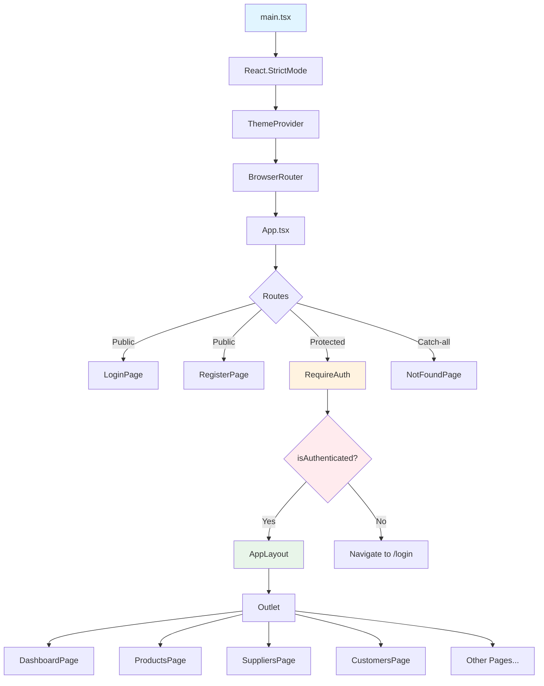
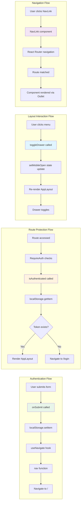
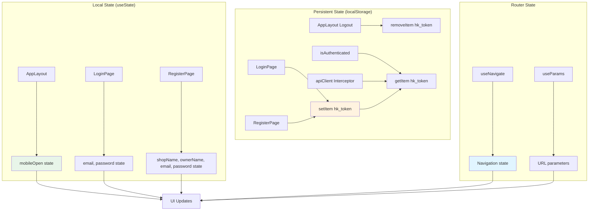
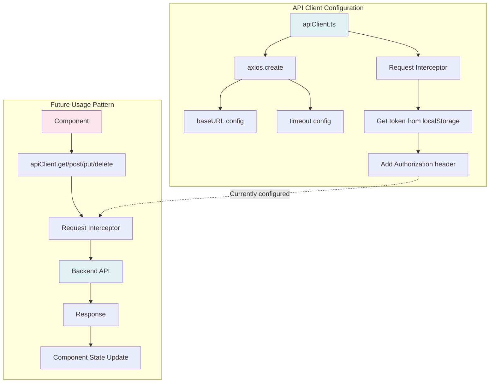
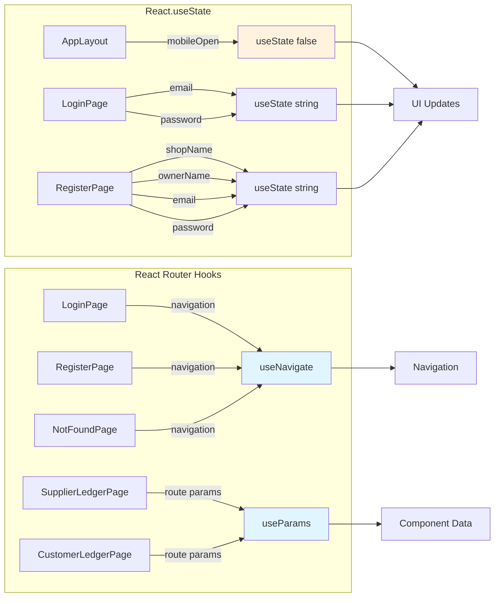

# React.js Call Graph Analysis

This document provides a detailed call graph analysis of the Hisaab Khata frontend application, showing component hierarchy, function calls, hooks usage, and service interactions.

---

## 1. Complete Call Graph Diagram

```mermaid
graph TB
    %% Entry Point
    main[main.tsx<br/>Entry Point]
    
    %% React Core
    StrictMode[React.StrictMode]
    ReactDOM[ReactDOM.createRoot]
    
    %% Providers
    ThemeProvider[ThemeProvider<br/>MUI Theme Context]
    BrowserRouter[BrowserRouter<br/>React Router Context]
    
    %% Theme System
    theme[theme.ts<br/>createTheme]
    
    %% Root Component
    App[App.tsx<br/>Route Configuration]
    
    %% Auth Utilities
    isAuthenticated[isAuthenticated<br/>localStorage check]
    RequireAuth[RequireAuth<br/>HOC Component]
    
    %% Layout
    AppLayout[AppLayout.tsx<br/>Main Layout]
    
    %% Router Components
    Routes[Routes Component]
    Route[Route Components]
    Outlet[Outlet<br/>Child Route Renderer]
    NavLink[NavLink<br/>Navigation Links]
    
    %% Auth Pages
    LoginPage[LoginPage.tsx]
    RegisterPage[RegisterPage.tsx]
    
    %% Protected Pages
    DashboardPage[DashboardPage.tsx]
    ProductsPage[ProductsPage.tsx]
    SuppliersPage[SuppliersPage.tsx]
    SupplierLedgerPage[SupplierLedgerPage.tsx]
    CustomersPage[CustomersPage.tsx]
    CustomerLedgerPage[CustomerLedgerPage.tsx]
    LedgerPage[LedgerPage.tsx]
    PurchasesPage[PurchasesPage.tsx]
    CreatePurchasePage[CreatePurchasePage.tsx]
    SalesPage[SalesPage.tsx]
    CreateSalePage[CreateSalePage.tsx]
    StaffPage[StaffPage.tsx]
    NotFoundPage[NotFoundPage.tsx]
    
    %% React Hooks
    useState[React.useState<br/>Local State]
    useNavigate[useNavigate<br/>React Router Hook]
    useParams[useParams<br/>React Router Hook]
    
    %% Local Storage
    localStorage[localStorage<br/>Browser Storage]
    
    %% API Layer
    apiClient[apiClient.ts<br/>Axios Instance]
    interceptor[Request Interceptor<br/>Auth Token Injection]
    
    %% MUI Components
    MUIComponents[MUI Components<br/>Box, Card, Button, etc.]
    
    %% Function Calls
    onSubmit[onSubmit<br/>Form Handler]
    toggleDrawer[toggleDrawer<br/>Mobile Menu Toggle]
    nav[nav Function<br/>Navigation Helper]
    
    %% Connections - Entry Flow
    main --> ReactDOM
    ReactDOM --> StrictMode
    StrictMode --> ThemeProvider
    ThemeProvider --> theme
    ThemeProvider --> BrowserRouter
    BrowserRouter --> App
    
    %% App Structure
    App --> Routes
    Routes --> Route
    Route --> LoginPage
    Route --> RegisterPage
    Route --> RequireAuth
    RequireAuth --> isAuthenticated
    RequireAuth --> AppLayout
    AppLayout --> Outlet
    AppLayout --> NavLink
    
    %% Child Routes
    Outlet --> DashboardPage
    Outlet --> ProductsPage
    Outlet --> SuppliersPage
    Outlet --> SupplierLedgerPage
    Outlet --> CustomersPage
    Outlet --> CustomerLedgerPage
    Outlet --> LedgerPage
    Outlet --> PurchasesPage
    Outlet --> CreatePurchasePage
    Outlet --> SalesPage
    Outlet --> CreateSalePage
    Outlet --> StaffPage
    Outlet --> NotFoundPage
    
    %% State Management
    AppLayout --> useState
    LoginPage --> useState
    RegisterPage --> useState
    SupplierLedgerPage --> useParams
    CustomerLedgerPage --> useParams
    
    %% Navigation
    LoginPage --> useNavigate
    RegisterPage --> useNavigate
    NotFoundPage --> useNavigate
    useNavigate --> nav
    
    %% Auth Flow
    LoginPage --> onSubmit
    RegisterPage --> onSubmit
    onSubmit --> localStorage
    isAuthenticated --> localStorage
    
    %% Layout Functions
    AppLayout --> toggleDrawer
    toggleDrawer --> useState
    
    %% API Layer (Configured but not actively used)
    apiClient --> interceptor
    interceptor --> localStorage
    
    %% MUI Integration
    ThemeProvider --> MUIComponents
    AppLayout --> MUIComponents
    LoginPage --> MUIComponents
    RegisterPage --> MUIComponents
    DashboardPage --> MUIComponents
    ProductsPage --> MUIComponents
    SuppliersPage --> MUIComponents
    SupplierLedgerPage --> MUIComponents
    CustomersPage --> MUIComponents
    CustomerLedgerPage --> MUIComponents
    LedgerPage --> MUIComponents
    PurchasesPage --> MUIComponents
    CreatePurchasePage --> MUIComponents
    SalesPage --> MUIComponents
    CreateSalePage --> MUIComponents
    StaffPage --> MUIComponents
    NotFoundPage --> MUIComponents
    
    %% Styling
    MUIComponents -.->|sx prop| ThemeProvider
    
    %% Styling Classes
    classDef entryPoint fill:#e1f5ff,stroke:#01579b,stroke-width:3px
    classDef provider fill:#f3e5f5,stroke:#4a148c,stroke-width:2px
    classDef component fill:#e8f5e9,stroke:#1b5e20,stroke-width:2px
    classDef hook fill:#fff3e0,stroke:#e65100,stroke-width:2px
    classDef utility fill:#fce4ec,stroke:#880e4f,stroke-width:2px
    classDef api fill:#e0f2f1,stroke:#004d40,stroke-width:2px
    
    class main,ReactDOM entryPoint
    class ThemeProvider,BrowserRouter provider
    class App,AppLayout,LoginPage,RegisterPage,DashboardPage,ProductsPage,SuppliersPage,SupplierLedgerPage,CustomersPage,CustomerLedgerPage,LedgerPage,PurchasesPage,CreatePurchasePage,SalesPage,CreateSalePage,StaffPage,NotFoundPage component
    class useState,useNavigate,useParams hook
    class isAuthenticated,RequireAuth,onSubmit,toggleDrawer,nav utility
    class apiClient,interceptor,localStorage api
```



---

## 2. Component Hierarchy Flow



---

## 3. Function Call Flow



---

## 4. State Management Flow



---

## 5. API/Service Layer Flow



---

## 6. Hook Usage Map



---

## 7. Major Flow Explanations

### 7.1 Application Initialization Flow

**Flow:** `main.tsx` → `ReactDOM.createRoot` → `React.StrictMode` → `ThemeProvider` → `BrowserRouter` → `App`

**Explanation:**
1. **Entry Point (`main.tsx`)**: Application bootstrap that creates the React root and renders the app
2. **React.StrictMode**: Wraps the app for development-time checks and warnings
3. **ThemeProvider**: Provides Material-UI theme context to all child components
4. **BrowserRouter**: Enables client-side routing using HTML5 history API
5. **App Component**: Defines all routes and route protection logic

**Key Points:**
- Providers are nested in a specific order (theme → router → app)
- Theme configuration is loaded once and shared via context
- Router context enables navigation hooks throughout the app

---

### 7.2 Authentication Flow

**Flow:** `LoginPage/RegisterPage` → `onSubmit` → `localStorage.setItem` → `useNavigate` → `RequireAuth` → `isAuthenticated` → `AppLayout`

**Explanation:**
1. **Form Submission**: User submits credentials via form
2. **Token Storage**: Currently stores a demo token in localStorage (TODO: real API call)
3. **Navigation**: Uses `useNavigate` hook to programmatically navigate
4. **Route Protection**: `RequireAuth` HOC checks authentication before rendering protected routes
5. **Authentication Check**: `isAuthenticated()` helper function checks for token existence

**Key Points:**
- Authentication is currently client-side only (demo mode)
- Token is stored in localStorage for persistence
- Navigation uses `replace: true` to prevent back button issues
- `RequireAuth` acts as a Higher-Order Component (HOC)

---

### 7.3 Layout and Navigation Flow

**Flow:** `AppLayout` → `NavLink` → `React Router` → `Outlet` → `Page Components`

**Explanation:**
1. **AppLayout**: Provides consistent layout structure (AppBar, Drawer, main content area)
2. **Navigation**: `NavLink` components provide active state styling
3. **Route Matching**: React Router matches URL to route configuration
4. **Child Rendering**: `Outlet` component renders matched child routes
5. **Page Components**: Individual page components are rendered in the main content area

**Key Points:**
- Layout is shared across all protected routes
- Navigation drawer is responsive (mobile: temporary, desktop: permanent)
- Active route highlighting is handled by `NavLink` component
- `Outlet` is the placeholder where child routes render

---

### 7.4 State Management Flow

**Flow:** `Component` → `useState` → `State Update` → `Re-render` → `UI Update`

**Explanation:**
1. **Local State**: Each component manages its own state using `useState` hook
2. **State Updates**: State setters trigger React re-renders
3. **Controlled Components**: Form inputs are controlled by component state
4. **Persistent State**: Authentication token stored in localStorage (not React state)

**Key Points:**
- No global state management (no Context API, Redux, or Zustand)
- State is component-local, promoting component independence
- localStorage used for persistence across sessions
- Form inputs follow controlled component pattern

---

### 7.5 API Layer Flow (Configured but Not Actively Used)

**Flow:** `apiClient` → `Request Interceptor` → `localStorage` → `Authorization Header` → `Backend API`

**Explanation:**
1. **API Client**: Axios instance configured with baseURL and timeout
2. **Request Interceptor**: Automatically adds Authorization header to all requests
3. **Token Retrieval**: Gets token from localStorage on each request
4. **Header Injection**: Adds `Bearer {token}` to request headers
5. **Backend Communication**: Ready for HTTP requests (not yet used in components)

**Key Points:**
- API client is configured but components don't use it yet
- Interceptor pattern ensures all requests include auth token
- BaseURL is configurable via environment variable
- Ready for backend integration when needed

---

## 8. Tight Coupling Analysis

### 8.1 Identified Tight Couplings

#### 🔴 **High Coupling Issues**

1. **Direct localStorage Access in Multiple Components**
   - **Location**: `LoginPage.tsx`, `RegisterPage.tsx`, `App.tsx`, `AppLayout.tsx`, `apiClient.ts`
   - **Issue**: Components directly access `localStorage.getItem("hk_token")` and `localStorage.setItem("hk_token")`
   - **Impact**: Hard to change storage mechanism, difficult to test, scattered logic
   - **Recommendation**: Create an `authService` or `authUtils` module to centralize auth operations

2. **Hard-coded Token Key String**
   - **Location**: Multiple files use `"hk_token"` string literal
   - **Issue**: String duplication, typo risk, hard to change
   - **Recommendation**: Define as constant: `const AUTH_TOKEN_KEY = "hk_token"`

3. **AppLayout Directly Manipulates window.location**
   - **Location**: `AppLayout.tsx` line 107: `window.location.href = "/login"`
   - **Issue**: Bypasses React Router, causes full page reload
   - **Recommendation**: Use `useNavigate()` hook instead

4. **isAuthenticated Function in App.tsx**
   - **Location**: `App.tsx` line 20
   - **Issue**: Auth logic mixed with routing logic
   - **Recommendation**: Move to separate `authUtils.ts` or `authService.ts`

#### 🟡 **Medium Coupling Issues**

1. **No Service Layer Abstraction**
   - **Issue**: Components will need to directly import `apiClient` when API calls are added
   - **Impact**: Tight coupling between UI and HTTP client
   - **Recommendation**: Create service layer (e.g., `productService`, `supplierService`) that wraps `apiClient`

2. **Theme Configuration Not Modularized**
   - **Location**: `theme.ts` has all theme config in one file
   - **Issue**: Will become large as theme grows
   - **Recommendation**: Split into `palette.ts`, `typography.ts`, `components.ts`

3. **NavItems Array in AppLayout**
   - **Location**: `AppLayout.tsx` lines 28-37
   - **Issue**: Navigation structure hardcoded in layout component
   - **Recommendation**: Extract to `config/navigation.ts` or `constants/navItems.ts`

#### 🟢 **Low Coupling (Good Practices)**

1. ✅ **Component Isolation**: Each page component is independent
2. ✅ **Hook Usage**: Proper use of React hooks (useState, useNavigate, useParams)
3. ✅ **Route Configuration**: Centralized in `App.tsx`
4. ✅ **MUI Component Usage**: Proper use of Material-UI components

---

## 9. Improvement Suggestions

### 9.1 Immediate Improvements

#### 1. **Create Auth Service Module**
```typescript
// src/services/authService.ts
export const AUTH_TOKEN_KEY = "hk_token";

export const authService = {
  getToken: () => localStorage.getItem(AUTH_TOKEN_KEY),
  setToken: (token: string) => localStorage.setItem(AUTH_TOKEN_KEY, token),
  removeToken: () => localStorage.removeItem(AUTH_TOKEN_KEY),
  isAuthenticated: () => Boolean(localStorage.getItem(AUTH_TOKEN_KEY))
};
```

**Benefits:**
- Single source of truth for auth operations
- Easy to test and mock
- Easy to change storage mechanism later

#### 2. **Fix Logout to Use React Router**
```typescript
// In AppLayout.tsx
const nav = useNavigate();

const handleLogout = () => {
  authService.removeToken();
  nav("/login", { replace: true });
};
```

**Benefits:**
- No full page reload
- Proper React Router navigation
- Better user experience

#### 3. **Extract Navigation Configuration**
```typescript
// src/config/navigation.ts
export const navItems = [
  { label: "Dashboard", to: "/", icon: DashboardIcon },
  // ... rest of items
];
```

**Benefits:**
- Reusable navigation config
- Easier to modify navigation structure
- Can be used in tests

### 9.2 Architecture Improvements

#### 1. **Service Layer Pattern**
Create service interfaces and implementations:
```typescript
// src/services/productService.ts
import { apiClient } from "../api";

export const productService = {
  getAll: () => apiClient.get("/products"),
  getById: (id: string) => apiClient.get(`/products/${id}`),
  create: (data: Product) => apiClient.post("/products", data),
  // ...
};
```

**Benefits:**
- Components don't need to know about HTTP details
- Easy to swap mock/real implementations
- Centralized error handling

#### 2. **Custom Hooks for Common Patterns**
```typescript
// src/hooks/useAuth.ts
export function useAuth() {
  const nav = useNavigate();
  
  const login = (token: string) => {
    authService.setToken(token);
    nav("/", { replace: true });
  };
  
  const logout = () => {
    authService.removeToken();
    nav("/login", { replace: true });
  };
  
  return {
    isAuthenticated: authService.isAuthenticated(),
    login,
    logout
  };
}
```

**Benefits:**
- Reusable auth logic
- Consistent auth behavior
- Easier to test

#### 3. **Error Boundary Component**
```typescript
// src/components/ErrorBoundary.tsx
class ErrorBoundary extends React.Component {
  // Error handling implementation
}
```

**Benefits:**
- Graceful error handling
- Better user experience
- Error logging

### 9.3 State Management Improvements

#### 1. **Consider Context API for Auth State**
```typescript
// src/contexts/AuthContext.tsx
export const AuthContext = createContext<AuthContextType>(null);

export function AuthProvider({ children }) {
  const [isAuthenticated, setIsAuthenticated] = useState(
    authService.isAuthenticated()
  );
  // ... provider logic
}
```

**Benefits:**
- Centralized auth state
- Avoids prop drilling
- Reactive auth state updates

#### 2. **React Query for Server State**
When API integration happens, consider React Query:
```typescript
// Example with React Query
const { data, isLoading } = useQuery('products', productService.getAll);
```

**Benefits:**
- Automatic caching
- Loading/error states
- Refetching logic

---

## 10. Component Dependency Graph

```mermaid
graph TD
    subgraph "Core Dependencies"
        React[React]
        ReactRouter[react-router-dom]
        MUI[@mui/material]
        Axios[axios]
    end
    
    subgraph "Application Components"
        App[App.tsx]
        AppLayout[AppLayout.tsx]
        Pages[Page Components]
    end
    
    subgraph "Utilities"
        AuthUtils[Auth Utils<br/>Future]
        ApiClient[apiClient.ts]
        Theme[theme.ts]
    end
    
    App --> React
    App --> ReactRouter
    AppLayout --> React
    AppLayout --> ReactRouter
    AppLayout --> MUI
    Pages --> React
    Pages --> MUI
    Pages --> ReactRouter
    ApiClient --> Axios
    AuthUtils -.->|Future| App
    AuthUtils -.->|Future| AppLayout
    AuthUtils -.->|Future| Pages
    
    style React fill:#61dafb
    style ReactRouter fill:#ca4245
    style MUI fill:#007fff
    style Axios fill:#5a29e4
```

---

## 11. Summary

### Current Architecture Strengths
✅ Clean component structure  
✅ Proper use of React hooks  
✅ Centralized routing configuration  
✅ Material-UI integration  
✅ TypeScript usage  

### Areas for Improvement
⚠️ **Tight Coupling**: Direct localStorage access scattered across components  
⚠️ **No Service Layer**: Components will be tightly coupled to apiClient  
⚠️ **Mixed Concerns**: Auth logic mixed with routing logic  
⚠️ **No Error Handling**: Missing error boundaries and API error handling  
⚠️ **No Loading States**: No loading indicators for async operations  

### Recommended Next Steps
1. **Short-term**: Extract auth utilities, fix logout navigation
2. **Medium-term**: Create service layer, add error boundaries
3. **Long-term**: Consider Context API for auth state, React Query for server state

---

*Last Updated: Based on codebase analysis as of current state*