# Sequence Diagrams - Hisaab Khata Frontend

This document contains sequence diagrams explaining all major user flows in the React.js application.

---

## 1. Application Initialization Flow

This flow shows how the application starts up and initializes all providers and routing.

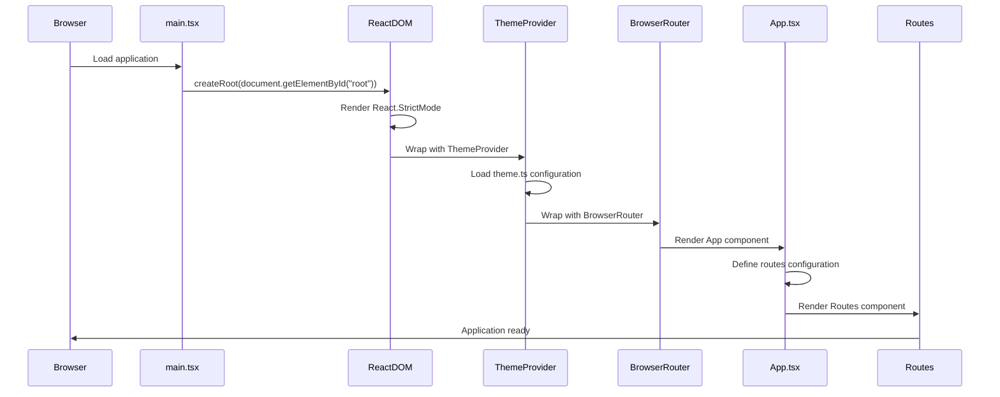

---

## 2. Login Flow

This flow shows the complete login process from user input to navigation to dashboard.

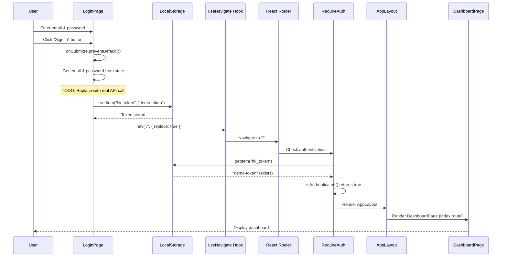

---

## 3. Register Flow

This flow shows the shop registration process.

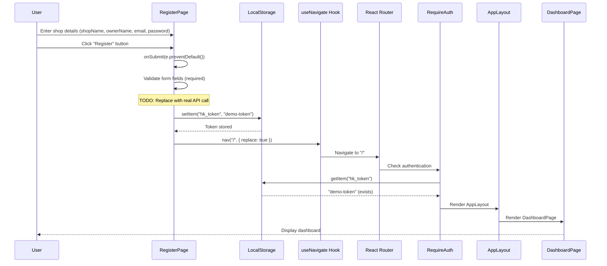

---

## 4. Protected Route Access Flow

This flow shows what happens when a user tries to access a protected route.

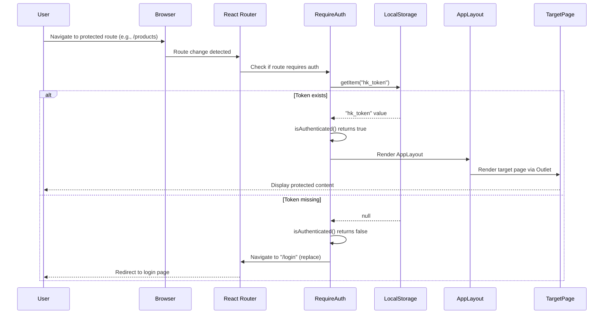

---

## 5. Navigation Flow (User Clicks Nav Link)

This flow shows how navigation works when a user clicks a navigation link in the sidebar.

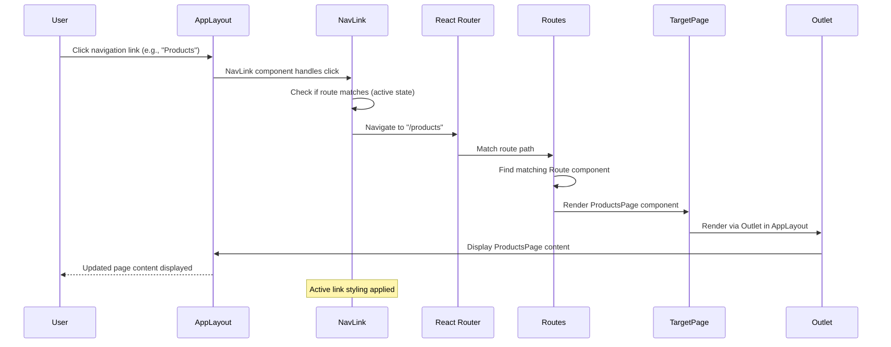

---

## 6. Logout Flow

This flow shows the logout process.

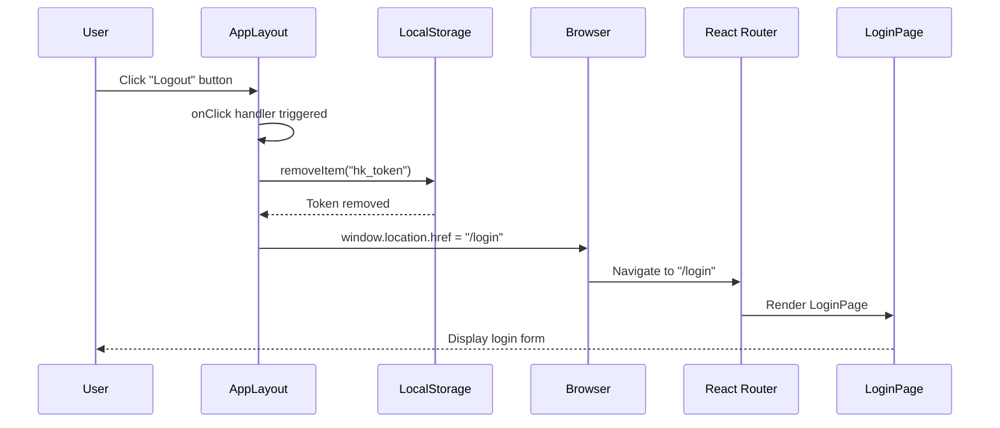

---

## 7. Form Input Change Flow (Controlled Components)

This flow shows how form inputs are handled using controlled components pattern.

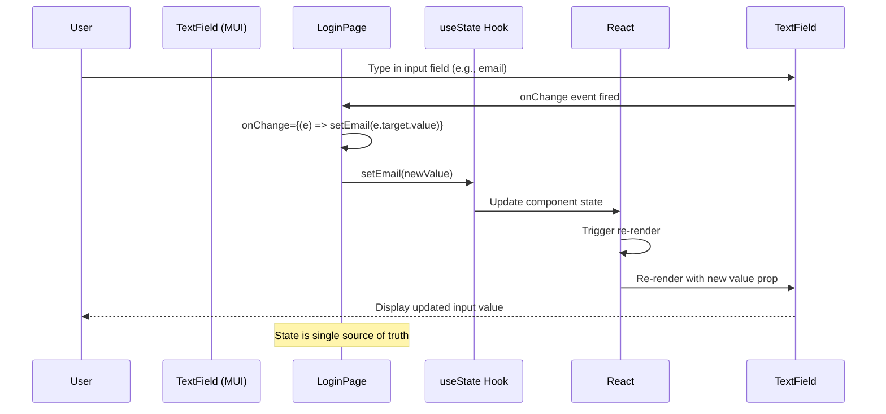

---

## 8. Mobile Drawer Toggle Flow

This flow shows how the mobile navigation drawer is toggled.

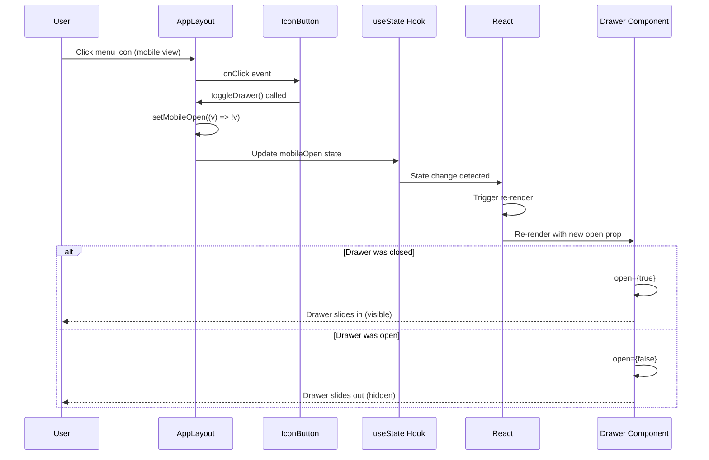

---

## 9. API Request Flow (With Interceptor)

This flow shows how API requests would work with the axios interceptor (currently configured but not actively used in pages).

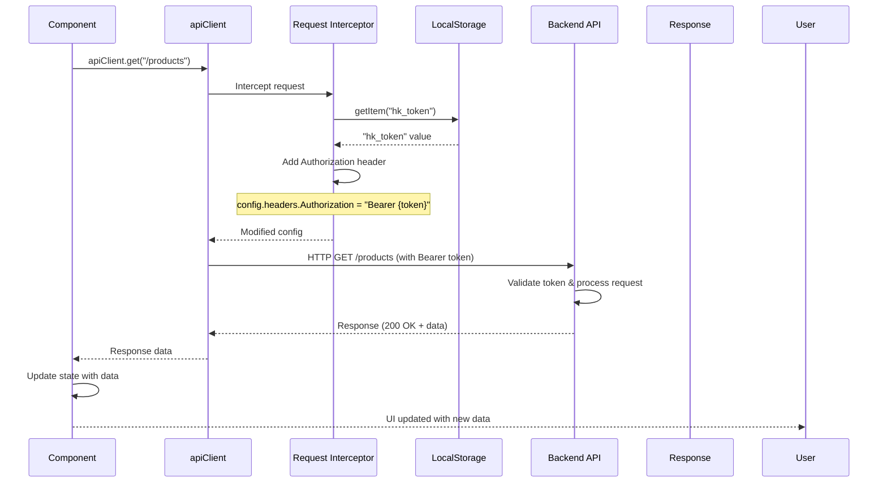

---

## 10. Dynamic Route Parameter Access Flow

This flow shows how dynamic route parameters (like `/suppliers/:id`) are accessed.

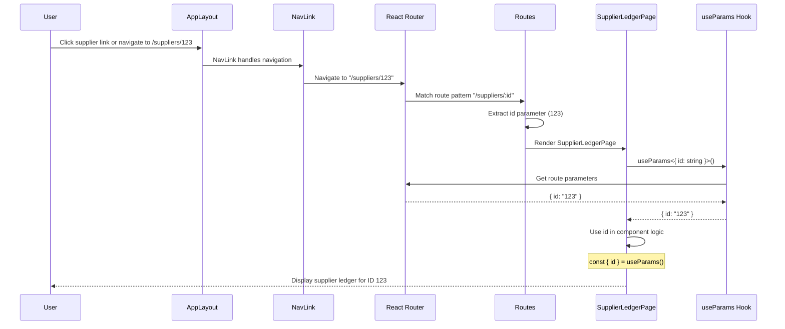

---

## 11. 404 Not Found Flow

This flow shows what happens when a user navigates to a non-existent route.

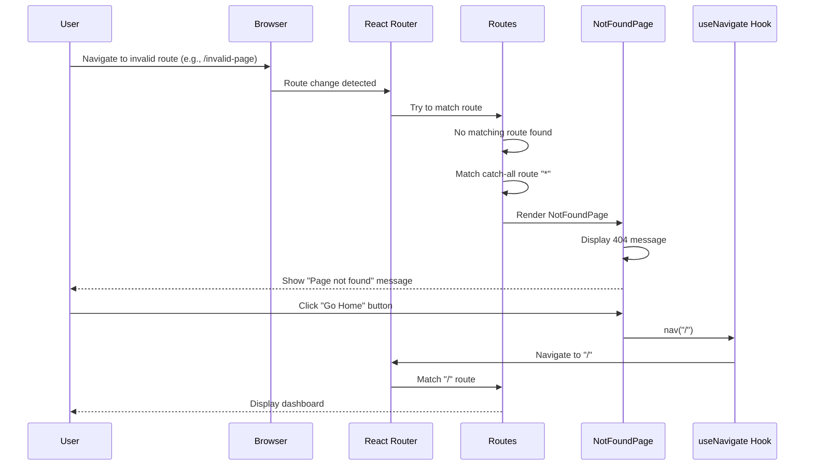

---

## 12. Theme Application Flow

This flow shows how the Material-UI theme is applied throughout the application.

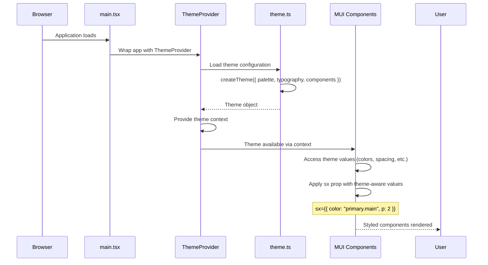

---

## Notes on Current Implementation

### Implemented Flows
- ✅ Application initialization
- ✅ Login (demo token storage)
- ✅ Register (demo token storage)
- ✅ Protected route access
- ✅ Navigation
- ✅ Logout
- ✅ Form input handling (controlled components)
- ✅ Mobile drawer toggle
- ✅ Dynamic route parameters
- ✅ 404 handling
- ✅ Theme application

### Not Yet Implemented (Placeholders)
- ❌ Real API calls (currently using localStorage demo tokens)
- ❌ Data fetching from backend
- ❌ CRUD operations (Create, Read, Update, Delete)
- ❌ Form submissions to backend
- ❌ Error handling for API calls
- ❌ Loading states
- ❌ Data tables with real data

### Future Flows (When Implemented)
When the backend integration is complete, additional flows will include:
- Product CRUD operations
- Supplier CRUD operations
- Customer CRUD operations
- Purchase creation and listing
- Sale creation and listing
- Ledger entry management
- Staff management
- Dashboard data fetching

---

*Last Updated: Based on codebase analysis as of current state*